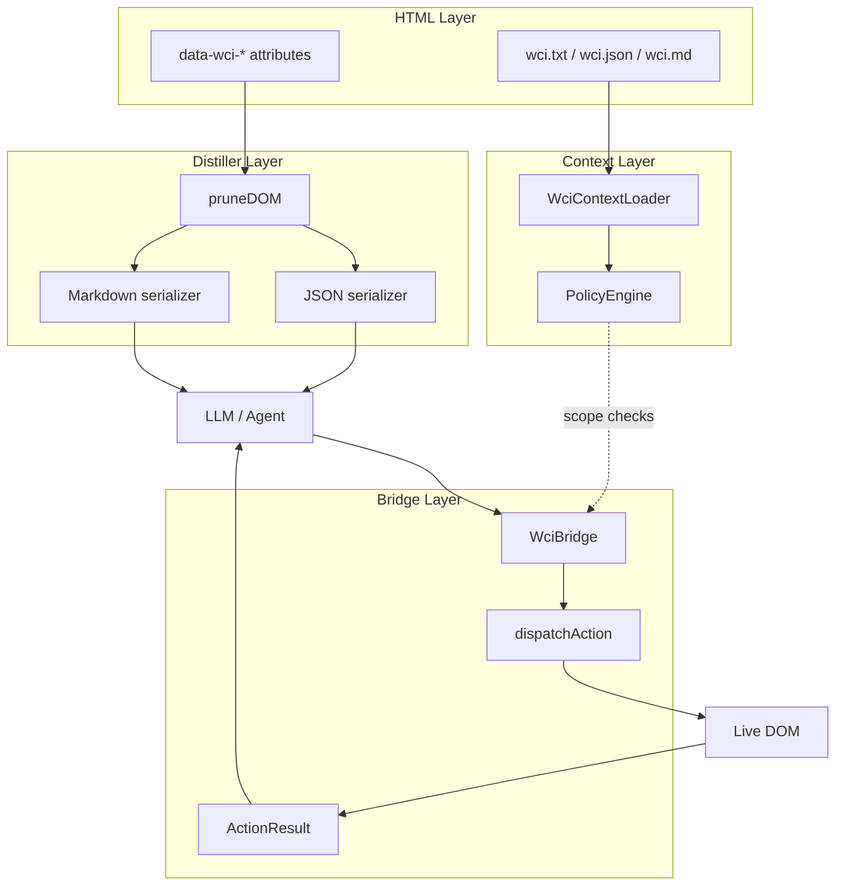

# Architecture

WCI separates **what the agent sees**, **what the site allows**, and **how actions execute** into three cooperating layers.

## Layer 1 — Semantic HTML (`@wci/spec`)

Standard DOM nodes carry machine-readable metadata:

- **Identity** — `data-wci-id`
- **Role** — `action`, `form`, `display`, `nav`, `status`, `landmark`
- **Intent** — `data-wci-desc`, `data-wci-action`
- **State** — `data-wci-state` (JSON snapshot)
- **Guards** — `data-wci-precondition`, `data-wci-required`

`readWciNodeSpec(element)` maps attributes to the `WciNodeSpec` TypeScript interface.

## Layer 2 — Distiller (`@wci/distiller`)

The distiller walks the DOM, collects annotated nodes, sorts by priority, and emits a compact **WciView** (JSON) or Markdown string suitable for LLM context windows.

Design goals:

- Drop decorative/layout nodes (`data-wci-hidden`)
- Scope to a landmark (`scope` option)
- Cap node count (`maxNodes`) for token budgets
- Optionally attach site summary metadata

## Layer 3 — Bridge (`@wci/bridge`)

The bridge translates agent decisions into real DOM interactions:

| Action | DOM effect |
|--------|------------|
| `click` | `.click()`, updates state |
| `fill` | Native value setter + `input`/`change` events |
| `select` | `<select>.value` + `change` |
| `check` | checkbox `checked` + `change` |
| `focus` | `.focus()` |
| `clear` | Clears input value |
| `submit` | `form.requestSubmit()` |
| `navigate` | `window.location.href` |

Every dispatch returns a typed **`ActionResult`**: success flag, before/after state, optional **side effects** on sibling nodes, and structured errors (`NODE_NOT_FOUND`, `PRECONDITION_UNMET`, etc.).

State changes also emit `wci:state-change` on `document` for observers.

## Site context (`@wci/context`)

Before touching a page, agents can load site policy:

1. HTTP headers (`X-WCI-*`)
2. Well-known URIs (`/.well-known/wci/*`)
3. Root fallbacks (`/wci.txt`, `/wci.json`, `/wci.md`)

`PolicyEngine` enforces allow/deny scopes, auth requirements, and human-confirmation scopes.

## Typical agent loop

1. `WciContextLoader.load()` → system prompt + policy
2. `WciDistiller.distilJSON()` → page tool context
3. LLM chooses `{ nodeId, action, value }`
4. `WciBridge.dispatch()` → `ActionResult`
5. Re-distil or read `sideEffects` → next turn

## Size and deployment

Packages are tree-shakeable ESM/CJS builds. Use only the layers you need:

- Read-only crawlers: `@wci/distiller` + `@wci/spec`
- In-page agents: add `@wci/bridge`
- Multi-page flows: add `@wci/context`
