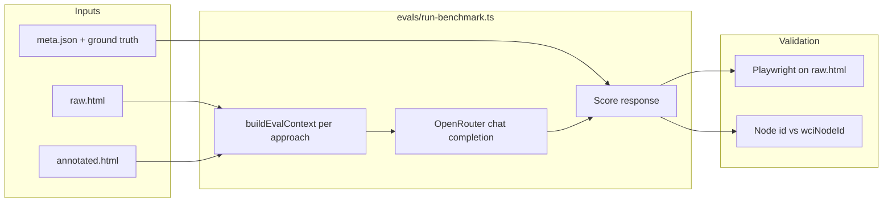

# WCI benchmark evaluation

Element-grounding benchmark: pick the correct control for a task using **OpenRouter** models (not proprietary agent SDKs).

**WebArena + WCI:** live benchmark integration, Docker bootstrap, and run commands — [`webarena/RUN.md`](./webarena/RUN.md) (overview: [`webarena/README.md`](./webarena/README.md)).

**Published runs:** [`demo/public/`](../demo/public/README.md) — per-model `eval-results-*.json` (leaderboard) and `eval-multistep-report-*.json` (audit trail) with comparison tables below.

## Approaches (5 per scenario)

**Published leaderboard** scores **multi-step task grounding** (`eval:multistep`): each scenario’s primary `meta.tasks.multiStep` task asks for a short action plan plus a **`final_action`** (WCI node id or CSS selector). WCI pass = correct final action and no decoy; baselines also require minimum **flow coverage** (`--min-coverage`, default `0.6`). See [Published results](#published-results-50-scenarios-may-2026) below.

A separate **single-shot** harness (`eval:benchmark`) still exists for one-control picking on `meta.goal`; it is not published on the demo site. Playwright validation uses verified ground truth in `demo/scenarios/` (see `evals/lib/ground-truth.ts`).

| ID | What the model sees | What it must return | How we score |
|----|---------------------|---------------------|--------------|
| **`raw-html`** | Full `raw.html` (truncated at ~28k chars if huge) — unannotated page, ads, decoys, generic button labels | One **CSS selector** | Selector must match the same element as ground-truth selectors in headless Chromium |
| **`dom-outline`** | Shallow tree (~100 lines) from raw HTML; interactive nodes marked `[interactive]` | One **CSS selector** | Same Playwright validation as raw-html |
| **`interactive-candidates`** | Numbered list of up to 50 controls scraped from raw HTML (Mind2Web-style) | Candidate **index** `[n]` or a CSS selector | Index resolved to a DOM node, then validated like raw-html |
| **`wci-full`** | JSON from `annotated.html`: **all** WCI nodes (landmarks, forms, displays, actions), parent `scope_context` merged onto children (e.g. flight `stops` on fare buttons). **No** eval state patches — page state is whatever the annotated file contains | One WCI node **`id`** string | Exact match to `wciNodeId` (or acceptable alternates); decoy ids tracked separately |
| **`wci-grounding`** | JSON from `annotated.html`: **actionable nodes only** (click/select/fill), disabled nodes omitted, same scope merge, plus **eval snapshot patches** on a few multi-step legacy scenarios (e.g. banking amount filled, checkout express selected) so the scored step is the final action | One WCI node **`id`** string | Same node-id scoring as `wci-full` |

### How to read the comparison

**Standard baselines** (`raw-html`, `dom-outline`, `interactive-candidates`) simulate agents that **do not** use WCI: they search messy DOM or lists with no `data-wci-*` layer. They share the same goals and the same underlying `raw.html` per scenario.

**WCI paths** assume an **annotation pass** already ran (`annotated.html` = same DOM as `raw.html` + `data-wci-*` overlays). The distiller/eval builder turns that into JSON; the model never sees raw tag soup for WCI conditions.

- **`wci-grounding`** is the **headline WCI score** — what you ship to an agent: small actionable menu, typed `state` / `precondition`, decision-point state where needed. Leaderboard column **“WCI Grounding”** uses this.
- **`wci-full`** is an **ablation** on the same annotations: full graph, no actionable filter, no snapshot patches. Models can answer with landmark ids (`quick-transfer`) or mid-flow controls; expect **lower** accuracy than grounding, especially on legacy banking/checkout/flight. Reported as **`wciFull`** in `eval-results.json`.

**`standard`** in the leaderboard is the average success rate across the three non-WCI approaches (not a separate API call).

Legacy CLI alias: `--approaches=wci-distilled` → `wci-grounding`.

Implementation: `evals/lib/contexts.ts` (`buildEvalContext`), prompts and truncation per row above.

## Models (default roster)

Configured in `evals/lib/llm.ts`:

| ID | OpenRouter slug |
|----|-----------------|
| `gpt5Nano` | `openai/gpt-5-nano` |
| `gpt5Mini` | `openai/gpt-5-mini` |
| `gpt5` | `openai/gpt-5` |
| `gemini3Flash` | `google/gemini-3-flash-preview` |
| `gemini35Flash` | `google/gemini-3.5-flash` |
| `gemini2FlashLite` | `google/gemini-2.0-flash-lite-001` |
| `qwen35Flash` | `qwen/qwen3.5-flash-02-23` |
| `qwen25_7b` | `qwen/qwen-2.5-7b-instruct` |
| `llama31_8b` | `meta-llama/llama-3.1-8b-instruct` |
| `deepseekV3` | `deepseek/deepseek-chat-v3-0324` |

## Commands

```bash
npm install
npx playwright install chromium

# bootstrap WebArena-facing benchmark scaffolding and WCI site drafts
npm run benchmark:wci:init
npm run benchmark:status
npm run eval:webarena:compare
npm run eval:webarena:compare -- --site=shopping
npm run eval:webarena:compare -- --runtime=hook --site=shopping
export SHOPPING=http://127.0.0.1:7770
npm run eval:webarena:annotate -- --site=shopping --verify

# Live WebArena: baseline vs WCI × OpenRouter models (requires SHOPPING + OPENROUTER_API_KEY)
npm run eval:webarena:benchmark -- --site=shopping
npm run eval:webarena:benchmark -- --models=gpt5Nano,gemini35Flash --approaches=raw-html,wci-grounding

npm run eval:verify
npm run eval:heuristic          # no API key

export OPENROUTER_API_KEY=sk-or-...
npm run eval:benchmark
npm run eval:multistep -- --heuristic-only

# Subset of models
npm run eval:benchmark -- --models=gpt5Nano,gpt5Mini,gemini3Flash

# WCI ablation only (10 calls per model)
npm run eval:benchmark -- --approaches=wci-full,wci-grounding --models=gpt5Nano

# Multi-step task benchmark (reads meta.tasks.multiStep — same five approaches as eval:benchmark)
npm run eval:multistep -- --heuristic-only
npm run eval:multistep -- --models=gpt5Nano --min-coverage=0.6
npm run eval:multistep -- --scenarios=job-board,banking --approaches=wci-grounding,raw-html

# Subset of scenarios (50 available — see demo/scenarios/README.md)
npm run eval:benchmark -- --scenarios=flight-booking,banking,checkout
npm run eval:heuristic -- --scenarios=job-board,healthcare-portal
```

WebArena-specific bootstrap and phased WCI integration plan: [`webarena/docs/benchmark-suite.md`](./webarena/docs/benchmark-suite.md).

Minimal WebArena adapter compare runner:

- default mock dry-run: `npm run eval:webarena:compare`
- sample subset: `npm run eval:webarena:compare -- --tasks=shopping.search-wireless-headphones`
- integration-stub mode: `npm run eval:webarena:compare -- --runtime=hook`

Full run ≈ **10 models × 50 scenarios × 5 approaches = 2,500** API calls. Use `--models=`, `--approaches=`, and `--scenarios=` to limit spend. Five **legacy** scenarios have the largest hand-authored DOM; the other **45** use distinct layouts with noise/decoys and constraint-based goals (see `demo/scenarios/README.md`).

**Reasoning:** every request sends `reasoning: { effort: "low" }` with `max_tokens: 1000`.

## How the benchmark runs (end-to-end)



1. **Load scenarios** — `demo/scenarios/manifest.json` (50 ids); optional `--scenarios=` filter.
2. **Verify ground truth** (always) — Playwright resolves `rawSelectors` in each `raw.html` (`npm run eval:verify`).
3. **For each model × approach × scenario:**
   - Build prompt from `evals/lib/contexts.ts` (goal + raw HTML, outline, candidate list, or WCI JSON).
   - Call OpenRouter (`evals/lib/llm.ts`, temperature 0, reasoning low, max_tokens 1000).
   - Parse one-line answer (CSS selector, `[index]`, or WCI `id`).
   - Score: Playwright match for baselines; exact node id (+ decoy flag) for WCI.
4. **Aggregate** — per-approach success %, avg token estimate; leaderboard bundles `standard` = mean of three baselines.
5. **Write** — `demo/public/eval-report.json` (full) and `eval-results.json` (summary). Copy to `eval-report-<model>.json` to archive (single-shot only; not used for the public demo).

**Multi-step write** — `demo/public/eval-multistep-report.json` (full). Archive as `eval-multistep-report-<model>.json`, then `npm run eval:merge-leaderboard` (see [demo/public/README.md](../demo/public/README.md)).
6. **Logs** (optional) — `evals/logs/<run-id>/<modelId>/<scenario>__<approach>.json` with prompts and responses.

**Single-shot report (`eval:benchmark`) does not measure full trajectories.**
For multi-step task scoring over `meta.tasks.multiStep` (primary task only), run `eval:multistep` — same five approaches as single-shot (`raw-html`, `dom-outline`, `interactive-candidates`, `wci-full`, `wci-grounding`).

**Pass rules (differs from single-shot):**

- **WCI** (`wci-grounding`, `wci-full`): correct `final_action` node id; no decoy id and no `data-wci-competitor` trap. Flow coverage is reported but not required for pass.
- **Baselines**: correct final action **and** minimum flow-type coverage (`--min-coverage`, default `0.6`). Coverage no longer auto-credits observe/verify from a correct final action alone.
- **Prompt discipline:** `wciFlow` / `standardFlow` steps are sanitized (no ground-truth ids in distill ranking). Pipe rows mark competitors with `x`. Goals include an explicit scored-`final_action` rule.

**Tokens:** Multistep uses **task-focused v2 pipe rows** (`evals/lib/wci-eval-distill.ts`): compact encoding (no repeated JSON keys per node), but **full desc (≤120)** and **state (≤96 chars)** where needed. Node count is **budget-based** (~2.4k / 3.2k chars for the WCI block), always including priority 1–2 controls — not a hard 12-node cap.

```json
{"v":2,"g":"g","N":["export-btn|c|1","deals-table|2|top:Foxtrot|D"]}
```

Pipe row order: `id|a|d|p|s|r` — skip empty segments. `a`: `c` click, `f` fill, … `s`: `k:v` state (`!=disabled`).

| agent.md attribute | In pipe row | Notes |
|--------------------|-------------|--------|
| `data-wci-id` | 1st | always |
| `data-wci-action` | `a` | abbreviated verb |
| `data-wci-desc` | `d` | omitted if redundant with id |
| `data-wci-priority` | `p` | only ≤2 |
| `data-wci-competitor` | `x` | competitor trap — never `final_action` |
| `data-wci-state` | `s` | compact `k:v` |
| `data-wci-role` | `r` | `wci-full` only |
| precondition, options, scope, … | — | omitted |

**Benchmark discipline (priority):** `scripts/lib/priority-competitors.mjs` runs on rebuild. Each scenario marks the ground-truth node with `data-wci-primary="true"` and adds 1–2 `data-wci-competitor="true"` nodes at **priority 1** so models cannot pass by always picking the first p=1 row. Prompt row order is shuffled per scenario id. Verify with `node scripts/verify-wci-ground-truth.mjs`. Eval state patches (`evals/lib/eval-snapshot.ts`) enable decisive actions (e.g. `review-transfer-btn`, `upload-iceland-album` when the raw page keeps them disabled).

**Flow coverage** (`evals/lib/flow-coverage.ts`): diagnostic score in `[0, 1]`, not used for WCI pass. Uses the better of (1) **type overlap** — infer `observe`/`act`/`verify` from step text, credit `final_action` as terminal `act`, impute `observe`+`verify` when WCI final id is correct — and (2) **step overlap** — keyword match against expected flow steps. Avoids false **0.33** when the model returns one correct `act` but omits explicit `observe`/`verify` labels.

---

## Published results (50 scenarios, May 2026)

Six archived OpenRouter **multi-step** runs on the full scenario set (primary `tasks.multiStep` only). Sources: `demo/public/eval-multistep-report-*.json` → `eval-results-*.json` via `npm run eval:merge-leaderboard`. Latest demo default: **GPT-5** in `eval-results.json`.

### Leaderboard summary (multi-step pass rate %)

| Model | Standard¹ | WCI grounding | WCI full | Δ grounding − standard | Avg tokens standard² | Avg tokens WCI grounding |
|-------|-----------|---------------|----------|------------------------|----------------------|---------------------------|
| **GPT-5** | 31% | **94%** | 94% | +63 pp | 2,387 | **764** |
| **GPT-5 Nano** | 15% | **86%** | 80% | +71 pp | 2,306 | **790** |
| **GPT-OSS 20B** | 1% | **86%** | 92% | +85 pp | 2,334 | **731** |
| **Gemini 3.5 Flash** | 1% | **96%** | 94% | +95 pp | 3,043 | **777** |
| **Qwen 2.5 7B** | 0% | **84%** | 86% | +84 pp | 2,258 | **546** |
| **Llama 3.1 8B** | 13% | **82%** | 78% | +69 pp | 2,185 | **807** |

¹ **Standard** = average **pass rate** of `raw-html`, `dom-outline`, and `interactive-candidates` (baselines require correct final action + flow coverage).  
² Token figures from `eval-results-*.json` (harness estimate / usage), not billing-grade.

### Per-approach pass rate (%)

| Model | raw-html | dom-outline | interactive-candidates | wci-full | **wci-grounding** |
|-------|----------|-------------|------------------------|----------|-------------------|
| GPT-5 | 2 | 18 | 74 | 94 | **94** |
| GPT-5 Nano | 0 | 0 | 46 | 80 | **86** |
| Gemini 3.5 Flash | 0 | 0 | 2 | 94 | **96** |
| Qwen 2.5 7B | 0 | 0 | 0 | 86 | **84** |
| GPT-OSS 20B | 2 | 0 | 2 | 92 | **86** |
| Llama 3.1 8B | 0 | 0 | 38 | 78 | **82** |

### Per-approach average tokens (per scenario call)

From `eval-multistep-report-*.json` → `models[].summary[].avgTokens`. Same 50 scenarios per column.

| Model | raw-html | dom-outline | interactive-candidates | wci-full | **wci-grounding** |
|-------|----------|-------------|------------------------|----------|-------------------|
| GPT-5 | 4,336 | 1,490 | 1,334 | 782 | **764** |
| GPT-5 Nano | 4,341 | 1,329 | 1,249 | 816 | **790** |
| Gemini 3.5 Flash | 5,939 | 1,752 | 1,438 | 829 | **777** |
| Qwen 2.5 7B | 4,496 | 1,106 | 1,172 | 572 | **546** |
| GPT-OSS 20B | 4,402 | 1,352 | 1,248 | 723 | **731** |
| Llama 3.1 8B | 4,130 | 1,197 | 1,227 | 834 | **807** |

### Success vs tokens (WCI grounding vs raw-html)

| Model | raw-html pass | raw-html tokens | wci-grounding pass | wci-grounding tokens | Token reduction³ |
|-------|---------------|-----------------|--------------------|----------------------|------------------|
| GPT-5 | 2% | 4,336 | **94%** | **764** | ~5.7× fewer |
| GPT-5 Nano | 0% | 4,341 | **86%** | **790** | ~5.5× fewer |
| Gemini 3.5 Flash | 0% | 5,939 | **96%** | **777** | ~7.6× fewer |
| Qwen 2.5 7B | 0% | 4,496 | **84%** | **546** | ~8.2× fewer |
| GPT-OSS 20B | 2% | 4,402 | **86%** | **731** | ~6.0× fewer |
| Llama 3.1 8B | 0% | 4,130 | **82%** | **807** | ~5.1× fewer |

³ Ratio = raw-html tokens ÷ wci-grounding tokens for the same model.

### Analysis

**Multi-step is strictly harder than single-shot.** Pass rates still drop vs one-shot grounding on the same pages: e.g. **GPT-5** **94%** WCI grounding (multi-step) vs **100%** (single-shot archived runs). Models must return a structured plan, correct **`final_action`**, and (for baselines) sufficient **flow coverage**.

**WCI grounding still leads.** **Gemini 3.5 Flash** tops the published set at **96%** multi-step pass; **GPT-5** is **94%**. Baselines stay near zero on `raw-html` / `dom-outline` (0–18%) except **`interactive-candidates`** on stronger models (**GPT-5** **74%**).

**Frontier vs small models:** **GPT-5 Nano** reaches **86%** WCI grounding multi-step in the latest run (v2 prompts + competitor traps) — closer to frontier models than earlier published snapshots, but still trails **GPT-5** / **Gemini** on baselines.

**Tokens:** Multi-step prompts are larger (action plans + flow text). WCI compact rows (`wci-eval-distill`) still keep grounding calls ~**546–790** tokens vs **4,100–5,900** for raw-html on the same tasks.

Inspect per-scenario failures in `demo/public/eval-multistep-report-*.json` (`flowCoverage`, `validationError`, `parsedFinalAction`).

---

## Limitations of this evaluation

These numbers are useful for comparing **context formats on a fixed grounding task**, but they are **not** a complete measure of “agent success on the real web.” Treat the following as scope boundaries, not minor footnotes.

### What the harness does *not* measure

| Gap | Why it matters |
|-----|----------------|
| **Live agent trajectories** | Published multi-step runs score one LLM plan + `final_action` per task (no observe → act → observe loop, backtracking, or recovery). `eval:benchmark` single-shot is even narrower (one control pick). |
| **Live browsing** | Static `raw.html` / `annotated.html` files in `demo/scenarios/`, loaded in Playwright — not dynamic SPAs, network delays, auth, or post-click DOM updates. |
| **Annotation cost / quality** | WCI paths assume `data-wci-*` is already correct and complete. The benchmark does not score mis-annotation, drift, or pages without annotations. |
| **Tooling ecosystems** | Models answer via OpenRouter chat only — not Browser Use, Playwright agents, computer-use APIs, or site-specific SDKs. |
| **End-user outcomes** | Success = “picked the element Playwright agrees is correct,” not task completion (payment succeeded, form submitted, etc.). |

### Task and dataset design

- **Synthetic scenarios** — Fifty fictional UIs (five large legacy pages + forty-five generated layouts). They are adversarial by design (noise, decoys, constraint-based goals) but still **offline fixtures**, not production traffic or public benchmarks like WebArena/Mind2Web pages at scale.
- **Single ground-truth step** — `meta.json` / `ground-truth.ts` define one target control per scenario. Real tasks often require several actions; `eval-snapshot.ts` only patches state for a few legacy flows so the *scored* step is the final button, which **helps** WCI grounding but is not how an agent always arrives there.
- **Heterogeneous difficulty** — Legacy scenarios (e.g. `flight-booking`, `banking`) differ sharply from generated ones; a single aggregate % blends unlike DOM sizes and failure modes.
- **Iterative benchmark tuning** — Goals, noise, and selectors were hardened so raw baselines stay hard while WCI stays solvable. Reported gaps partly reflect **this suite’s design**, not a universal law for all websites.

### Fairness of “standard” vs WCI

- **Asymmetric information** — Baselines see raw or derived DOM; WCI sees curated JSON with `desc`, `state`, `scope_context`, and (for grounding) an actionable-only filter. Higher WCI accuracy is expected; the fair claim is **efficiency + reliability given annotations exist**, not “same bits in, same bits out.”
- **`standard` is a blended metric** — Averaging `raw-html`, `dom-outline`, and `interactive-candidates` hides that some models score well on raw HTML (e.g. Gemini 88%) while outline/candidates stay near zero. Compare **per-approach tables**, not only the headline `standard` column.
- **`wci-full` ablation** — Still uses annotations without production filtering; it is not an unannotated baseline.

### Scoring and validation

- **Playwright-only check for baselines** — CSS selectors must parse and match ground-truth locators in Chromium. Model outputs using unsupported pseudo-selectors (e.g. `:has-text()` from legacy admin/banking) count as failures even when a human would understand the intent (`validationError` in `eval-multistep-report-*.json`).
- **Exact node id for WCI** — No partial credit for semantically close ids unless listed in `acceptableNodeIds`. Typos and alias resolution depend on `evals/lib/scorers.ts` heuristics.
- **No human eval** — Labels are author-defined; there is no inter-annotator agreement or crowd verification on the 50 goals.

### Model and runtime

- **Single provider stack** — OpenRouter, temperature `0`, `reasoning: { effort: "low" }`, `max_tokens: 1000` (see `evals/lib/llm.ts`). Other settings or hosts can change rankings.
- **Token figures are approximate** — Per-call `avgTokens` mixes harness `ceil(chars/4)` estimates and API usage when returned; they guide **relative** cost between approaches, not invoice accuracy.
- **Model roster changes** — Published snapshots in `demo/public/` are point-in-time; new models or API versions are not automatically comparable to archived JSON.

### How to use these results responsibly

- Use **`wci-grounding` vs baselines** to argue that structured context helps **one-shot control selection** on annotated pages.
- Do **not** claim the benchmark proves full autonomous agents beat commercial browser automation products without matching their task definitions and observation spaces.
- Prefer **subset runs** (`--scenarios=`, `--approaches=`) when adding scenarios or models, and archive reports under `demo/public/eval-multistep-report-<model>.json` for reproducibility.

---

## Outputs

| Artifact | Role |
|----------|------|
| `demo/public/eval-results.json` | Leaderboard snapshot (default model) |
| `demo/public/eval-results-all.json` | Merged leaderboard (demo) |
| `demo/public/eval-results-<model>.json` | Per-model snapshot from `eval:merge-leaderboard` |
| `demo/public/eval-multistep-report.json` | Latest full multi-step audit trail |
| `demo/public/eval-multistep-report-<model>.json` | Archived multi-step report |
| `demo/public/eval-report.json` | Single-shot audit trail (`eval:benchmark` only; not on demo) |
| `evals/logs/<run-id>/` | Per-call LLM I/O (JSON + Markdown). Disable with `--no-logs`. |

### LLM I/O logs

```
evals/logs/2026-05-22_21-20-48/
  manifest.json
  gpt5Nano/
    flight-booking__wci-grounding.json
    job-board__raw-html.md
    ...
```

The demo leaderboard loads **`demo/public/eval-results-all.json`** (merge archived runs with `npm run eval:merge-leaderboard`). It shows all models: standard baselines, WCI grounding, WCI full, and token averages per call.
