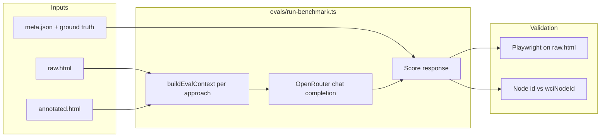

# WCI benchmark evaluation

Element-grounding benchmark: pick the correct control for a task using **OpenRouter** models (not proprietary agent SDKs).

**Published runs:** [`demo/public/`](../demo/public/README.md) — **`eval-results-*.json` is the source of truth for pass rates** (rebuilt by `eval:merge-leaderboard`); `eval-multistep-report-*.json` is the per-scenario audit trail (`rawResponse`, errors). Comparison tables below use merged results.

## Approaches (5 per scenario)

**Published leaderboard** scores **multi-step task grounding** (`eval:multistep`): each scenario’s primary `meta.tasks.multiStep` task asks for a short JSON action plan plus a **`final_action`** (WCI node id or CSS selector). **All five approaches** use the same pass rule: correct `final_action`, no decoy/competitor trap, and flow coverage ≥ `--min-coverage` (default `0.8`). See [Pass rules](#pass-rules-unified) and [Published results](#published-results-50-scenarios-may-2026).

A separate **single-shot** harness (`eval:benchmark`) still exists for one-control picking on `meta.goal`; it is not published on the demo site. Playwright validation uses verified ground truth in `demo/scenarios/` (see `evals/lib/ground-truth.ts`).

| ID | What the model sees | What it must return | How we score |
|----|---------------------|---------------------|--------------|
| **`raw-html`** | Full `raw.html` (truncated at ~28k chars if huge) — unannotated page, ads, decoys, generic button labels | One **CSS selector** | Selector must match the same element as ground-truth selectors in headless Chromium |
| **`dom-outline`** | Shallow tree (~100 lines) from raw HTML; interactive nodes marked `[interactive]` | One **CSS selector** | Same Playwright validation as raw-html |
| **`interactive-candidates`** | Numbered list of up to 50 controls scraped from raw HTML (Mind2Web-style) | Candidate **index** `[n]` or a CSS selector | Index resolved to a DOM node, then validated like raw-html |
| **`wci-full`** | JSON from `annotated.html`: **all** WCI nodes (landmarks, forms, displays, actions), parent `scope_context` merged onto children (e.g. flight `stops` on fare buttons). **No** eval state patches — page state is whatever the annotated file contains | One WCI node **`id`** string | Exact match to `wciNodeId` (or acceptable alternates); decoy ids tracked separately |
| **`wci-grounding`** | JSON from `annotated.html`: **actionable nodes only** (click/select/fill), disabled nodes omitted, same scope merge, plus **eval snapshot patches** on a few multi-step handmade scenarios (e.g. banking amount filled, checkout express selected) so the scored step is the final action | One WCI node **`id`** string | Same node-id scoring as `wci-full` |

### How to read the comparison

**This benchmark is not a “fair fight” between equal inputs.** It measures whether **good WCI annotations** make element grounding more reliable and cheaper than agents working from raw or derived DOM alone. The gap between `standard` and `wci-grounding` is the **benefit of the annotation layer** — that is the product thesis, not a scoring bug.

**Standard baselines** (`raw-html`, `dom-outline`, `interactive-candidates`) simulate agents that **do not** use WCI: they search messy DOM or scraped candidate lists with no `data-wci-*` layer. They share the same **goal text** and the same underlying `raw.html` per scenario, but not the same observation space or pass mechanics (see [Limitations](#limitations-and-scope)).

**WCI paths** assume an **annotation pass** already ran (`annotated.html` = same DOM as `raw.html` + `data-wci-*` overlays). The distiller/eval builder turns that into compact JSON or pipe rows; the model never sees raw tag soup for WCI conditions.

- **`wci-grounding`** is the **headline WCI score** — what you ship to an agent: small actionable menu, typed `state` / `precondition`, decision-point state where needed. Leaderboard column **“WCI Grounding”** uses this.
- **`wci-full`** is an **ablation** on the same annotations: full graph, no actionable filter, no snapshot patches. Models can answer with landmark ids (`quick-transfer`) or mid-flow controls; expect **lower** accuracy than grounding, especially on handmade flight booking / banking / checkout. Reported as **`wciFull`** in `eval-results.json`.

**`standard`** in the leaderboard is the average success rate across the three non-WCI approaches (not a separate API call).

Legacy CLI alias: `--approaches=wci-distilled` → `wci-grounding`.

Implementation: `evals/lib/contexts.ts` (`buildEvalContext`), prompts and truncation per row above.

## Models, prompts, and inference settings

Exact system prompts, temperature, `max_tokens`, reasoning effort, and OpenRouter model slugs are defined in **`evals/lib/eval-config.ts`** and exported to:

- [`docs/benchmark-eval-config.md`](../docs/benchmark-eval-config.md) — human-readable report
- [`demo/public/eval-config.json`](../demo/public/eval-config.json) — machine-readable (demo site **Evaluation Results** section)

Regenerate after prompt changes: `npm run eval:export-config`.

## Models (default roster)

Configured in `evals/lib/eval-config.ts` (re-exported from `evals/lib/llm.ts`):

| ID | OpenRouter slug |
|----|-----------------|
| `gpt5Nano` | `openai/gpt-5.4-nano` |
| `gpt5` | `openai/gpt-5.4` |
| `gemini35Flash` | `google/gemini-3.5-flash` |
| `qwen25_7b` | `qwen/qwen-2.5-7b-instruct` |
| `llama31_8b` | `meta-llama/llama-3.1-8b-instruct` |

## Commands

```bash
npm install
npx playwright install chromium

npm run eval:verify
npm run eval:heuristic          # no API key

export OPENROUTER_API_KEY=sk-or-...
npm run eval:benchmark
npm run eval:multistep -- --heuristic-only

# Subset of models
npm run eval:benchmark -- --models=gpt5Nano,gpt5Mini,gemini3Flash

# WCI ablation only (10 calls per model)
npm run eval:benchmark -- --approaches=wci-full,wci-grounding --models=gpt5Nano

# Multi-step task benchmark (reads meta.tasks.multiStep — same five approaches as eval:benchmark)
npm run eval:multistep -- --heuristic-only
npm run eval:multistep -- --models=gpt5Nano --min-coverage=0.8
npm run eval:multistep -- --scenarios=job-board,banking --approaches=wci-grounding,raw-html

# Subset of scenarios (50 available — see demo/scenarios/README.md)
npm run eval:benchmark -- --scenarios=flight-booking,banking,checkout
npm run eval:heuristic -- --scenarios=job-board,healthcare-portal

# Rebuild leaderboard from archived multistep reports (no API re-run)
npm run eval:merge-leaderboard
```

Full run ≈ **10 models × 50 scenarios × 5 approaches = 2,500** API calls. Use `--models=`, `--approaches=`, and `--scenarios=` to limit spend. Five **handmade** scenarios (flight booking, banking, checkout, dashboard, social media) have the largest hand-authored DOM; the other **45** synthetic layouts use distinct templates with noise/decoys and constraint-based goals (see `demo/scenarios/README.md`).

**Inference (published multi-step):** `temperature: 0`, `max_tokens: 800`, `reasoning: { effort: "low" }`. Single-shot `eval:benchmark` uses `max_tokens: 1000`. See [`docs/benchmark-eval-config.md`](../docs/benchmark-eval-config.md).

## How the benchmark runs (end-to-end)



1. **Load scenarios** — `demo/scenarios/manifest.json` (50 ids); optional `--scenarios=` filter.
2. **Verify ground truth** (always) — Playwright resolves `rawSelectors` in each `raw.html` (`npm run eval:verify`).
3. **For each model × approach × scenario:**
   - Build prompt from `evals/lib/contexts.ts` (goal + raw HTML, outline, candidate list, or WCI JSON).
   - Call OpenRouter (`evals/lib/llm.ts`, temperature 0, reasoning low, max_tokens 1000).
   - Parse one-line answer (CSS selector, `[index]`, or WCI `id`).
   - Score: Playwright match for baselines; exact node id (+ decoy flag) for WCI.
4. **Aggregate** — per-approach success %, avg token estimate; leaderboard bundles `standard` = mean of three baselines.
5. **Write** — `demo/public/eval-report.json` (full) and `eval-results.json` (summary). Copy to `eval-report-<model>.json` to archive (single-shot only; not used for the public demo).

**Multi-step write** — `demo/public/eval-multistep-report.json` (full). Archive as `eval-multistep-report-<model>.json`, then `npm run eval:merge-leaderboard` (see [demo/public/README.md](../demo/public/README.md)).
6. **Logs** (optional) — `evals/logs/<run-id>/<modelId>/<scenario>__<approach>.json` with prompts and responses.

**Single-shot report (`eval:benchmark`) does not measure full trajectories.**
For multi-step task scoring over `meta.tasks.multiStep` (primary task only), run `eval:multistep` — same five approaches as single-shot (`raw-html`, `dom-outline`, `interactive-candidates`, `wci-full`, `wci-grounding`).

### Pass rules (unified)

All approaches (`raw-html`, `dom-outline`, `interactive-candidates`, `wci-full`, `wci-grounding`) are scored using a unified pass rule. A task run passes if and only if:

$$\text{Pass} = \text{CorrectFinalAction} \land \neg \text{HitDecoy} \land (\text{FlowCoverage} \ge \text{minCoverage})$$

Where:

1. **Correct `final_action`** ($\text{CorrectFinalAction}$):
   - **WCI**: $\text{final\_action} \in \{\text{wciNodeId}\} \cup \text{acceptableNodeIds}$
   - **Baselines**: $\text{Resolve}(\text{final\_action}) = \text{Resolve}(\text{groundTruthSelector})$ in Playwright.
2. **No decoy** ($\neg \text{HitDecoy}$):
   - **WCI**: $\text{final\_action} \notin \text{decoyNodeIds}$ and the selected node is not marked as `data-wci-competitor="true"`.
   - **Baselines**: Always true (decoy identification is WCI-specific; selecting a decoy baseline selector fails the $\text{CorrectFinalAction}$ check).
3. **Flow coverage ≥ `minCoverage`** (default **0.8**):
   - $\text{FlowCoverage}$ is the set-based F1 score computed over unique flow-type buckets (see [Flow coverage](#flow-coverage) below).

**Prompt discipline:** `wciFlow` / `standardFlow` steps are sanitized before prompts (no ground-truth ids or selectors in flow text). Pipe rows mark competitor traps with `x`. Goals include an explicit scored-`final_action` suffix. Completion criteria that leak answers are filtered (`evals/lib/multistep-prompt.ts`).

**Leaderboard merge:** `npm run eval:merge-leaderboard` recomputes pass rates and coverage from archived `eval-multistep-report-*.json` task rows (`rawResponse` + current `evals/lib/flow-coverage.ts`) — no API re-run required when scoring logic changes.

**Tokens:** Multistep uses **task-focused v2 pipe rows** (`evals/lib/wci-eval-distill.ts`): compact encoding (no repeated JSON keys per node), but **full desc (≤120)** and **state (≤96 chars)** where needed. Node count is **budget-based** (~2.4k / 3.2k chars for the WCI block), always including priority 1–2 controls — not a hard 12-node cap.

```json
{"v":2,"g":"g","N":["export-btn|c|1","deals-table|2|top:Foxtrot|D"]}
```

Pipe row order: `id|a|d|p|s|r` — skip empty segments. `a`: `c` click, `f` fill, … `s`: `k:v` state (`!=disabled`).

| agent.md attribute | In pipe row | Notes |
|--------------------|-------------|--------|
| `data-wci-id` | 1st | always |
| `data-wci-action` | `a` | abbreviated verb |
| `data-wci-desc` | `d` | omitted if redundant with id |
| `data-wci-priority` | `p` | only ≤2 |
| `data-wci-competitor` | `x` | competitor trap — never `final_action` |
| `data-wci-state` | `s` | compact `k:v` |
| `data-wci-role` | `r` | `wci-full` only |
| precondition, options, scope, … | — | omitted |

**Benchmark discipline (priority):** `scripts/lib/priority-competitors.mjs` runs on rebuild. Each scenario marks the ground-truth node with `data-wci-primary="true"` and adds 1–2 `data-wci-competitor="true"` nodes at **priority 1** so models cannot pass by always picking the first p=1 row. Prompt row order is shuffled per scenario id. Verify with `node scripts/verify-wci-ground-truth.mjs`. Eval state patches (`evals/lib/eval-snapshot.ts`) enable decisive actions (e.g. `review-transfer-btn`, `upload-iceland-album` when the raw page keeps them disabled).

### Flow coverage

Implemented in [flow-coverage.ts](file:///Users/amirrezaalasti/Desktop/selfprojects/WIA_framework/evals/lib/flow-coverage.ts).
Score in `[0, 1]` used for **pass** on all approaches.
To prevent evaluation metrics from being inflated by recall-only criteria, the multi-step benchmark uses a **set-based F1 score** over unique flow-type buckets (such as `observe`, `act`, `verify`). F1 balances both precision (avoiding hallucinating incorrect or spurious action types) and recall (covering all expected types).

$$F1 = \frac{2 \cdot \text{Precision} \cdot \text{Recall}}{\text{Precision} + \text{Recall}}$$

Where:
- $\text{Recall} = \frac{|\text{Expected} \cap \text{Observed}|}{|\text{Expected}|}$
- $\text{Precision} = \frac{|\text{Expected} \cap \text{Observed}|}{|\text{Observed}|}$

The sets compared are the unique flow-type buckets:
- **Expected**: unique buckets present in the reference flow (e.g., `{observe, act, verify}`).
- **Observed**: unique buckets inferred from the model's generated plan (including explicit action types, keyword signals in step text, and imputed credits).

**Threshold: 0.8**
The default threshold for a plan to pass flow coverage is **0.8**. This threshold is derived empirically via Youden's J statistic over 1,500 archived runs to optimize the separation between correct and incorrect final actions. Semantically, F1 ≥ 0.8 is the J-optimal choice:
- On a typical 3-bucket flow (`{observe, act, verify}`), the model must correctly identify at least 2 of the 3 expected types with perfect precision (F1 = 0.8), or cover all 3 with perfect precision (F1 = 1.0). A model cannot pass if it has precision issues or hallucinates multiple spurious action types.

**Imputation when `final_action` is correct:**

| Approach | `act` | `observe` | `verify` |
|----------|-------|-----------|----------|
| **WCI** | credited | credited if expected in `wciFlow` | credited if expected in `wciFlow` |
| **Baselines** | credited | credited only if plan explicitly labels observe/reason | credited only if plan labels verify or uses verify/confirm language |

Rationale: a correct WCI node id implies the model read the annotated graph; a correct baseline selector implies DOM search but the harness still expects explicit observe/verify labels in the JSON plan when those buckets appear in `standardFlow`. WCI and baselines are scored against **different reference flows** (`wciFlow` vs `standardFlow`) — see [Limitations](#limitations-and-scope).

This avoids false **0.33** failures when a model returns one correct `act` plus `final_action` but omits explicit observe/verify labels on WCI paths.

---

## Published results (50 scenarios, May 2026)

Six archived OpenRouter **multi-step** runs on the full scenario set (primary `tasks.multiStep` only). Leaderboard numbers come from `demo/public/eval-results-*.json` (rescored from archived `eval-multistep-report-*.json` via `npm run eval:merge-leaderboard`, `minCoverage` **0.8**). Latest demo default: **GPT-5** in `eval-results.json`.

| Model | Standard¹ | WCI grounding | WCI full | Δ grounding − standard | Avg tokens standard² | Avg tokens WCI grounding |
|-------|-----------|---------------|----------|------------------------|----------------------|---------------------------|
| **GPT-5** | 29% | **84%** | 84% | +55 pp | 2,387 | **764** |
| **GPT-5 Nano** | 15% | **74%** | 74% | +59 pp | 2,306 | **790** |
| **GPT-OSS 20B** | 0% | **82%** | 88% | +82 pp | 2,334 | **731** |
| **Gemini 3.5 Flash** | 0% | **96%** | 92% | +96 pp | 3,043 | **777** |
| **Qwen 2.5 7B** | 0% | **76%** | 78% | +76 pp | 2,258 | **546** |
| **Llama 3.1 8B** | 11% | **78%** | 74% | +67 pp | 2,185 | **807** |

¹ **Standard** = average **pass rate** of `raw-html`, `dom-outline`, and `interactive-candidates` under the **same unified pass rule** as WCI.  
² Token figures from `eval-results-*.json` (harness estimate / usage), not billing-grade. Leaderboard rows include `"passRule": "unified"` and `"minCoverage": 0.8`.

### Per-approach pass rate (%)

| Model | raw-html | dom-outline | interactive-candidates | wci-full | **wci-grounding** |
|-------|----------|-------------|------------------------|----------|-------------------|
| GPT-5 | 0 | 18 | 68 | 84 | **84** |
| GPT-5 Nano | 0 | 0 | 44 | 74 | **74** |
| Gemini 3.5 Flash | 0 | 0 | 0 | 92 | **96** |
| Qwen 2.5 7B | 0 | 0 | 0 | 78 | **76** |
| GPT-OSS 20B | 0 | 0 | 0 | 88 | **82** |
| Llama 3.1 8B | 0 | 0 | 34 | 74 | **78** |

### Per-approach average tokens (per scenario call)

From `eval-multistep-report-*.json` → `models[].summary[].avgTokens`. Same 50 scenarios per column.

| Model | raw-html | dom-outline | interactive-candidates | wci-full | **wci-grounding** |
|-------|----------|-------------|------------------------|----------|-------------------|
| GPT-5 | 4,336 | 1,490 | 1,334 | 782 | **764** |
| GPT-5 Nano | 4,341 | 1,329 | 1,249 | 816 | **790** |
| Gemini 3.5 Flash | 5,939 | 1,752 | 1,438 | 829 | **777** |
| Qwen 2.5 7B | 4,496 | 1,106 | 1,172 | 572 | **546** |
| GPT-OSS 20B | 4,402 | 1,352 | 1,248 | 723 | **731** |
| Llama 3.1 8B | 4,130 | 1,197 | 1,227 | 834 | **807** |

### Success vs tokens (WCI grounding vs raw-html)

| Model | raw-html pass | raw-html tokens | wci-grounding pass | wci-grounding tokens | Token reduction³ |
|-------|---------------|-----------------|--------------------|----------------------|------------------|
| GPT-5 | 0% | 4,336 | **84%** | **764** | ~5.7× fewer |
| GPT-5 Nano | 0% | 4,341 | **74%** | **790** | ~5.5× fewer |
| Gemini 3.5 Flash | 0% | 5,939 | **96%** | **777** | ~7.6× fewer |
| Qwen 2.5 7B | 0% | 4,496 | **76%** | **546** | ~8.2× fewer |
| GPT-OSS 20B | 0% | 4,402 | **82%** | **731** | ~6.0× fewer |
| Llama 3.1 8B | 0% | 4,130 | **78%** | **807** | ~5.1× fewer |

³ Ratio = raw-html tokens ÷ wci-grounding tokens for the same model.

### Analysis

**Multi-step is strictly harder than single-shot.** Pass rates can drop vs one-shot grounding on the same pages: e.g. **GPT-5** **84%** WCI grounding (multi-step) vs **100%** (single-shot archived runs). Models must return a structured plan and correct **`final_action`**, not just one control id.

**WCI grounding still leads.** **Gemini 3.5 Flash** tops the published set at **96%** multi-step pass; **GPT-5** is **84%**. Baselines stay near zero on `raw-html` / `dom-outline` (0–18%) except **`interactive-candidates`** on stronger models (**GPT-5** **68%**).

**Frontier vs small models:** On WCI grounding, **GPT-5 Nano** (**74%**), **Qwen 2.5 7B** (**76%**), and **Llama 3.1 8B** (**78%**) trail frontier models but remain far above their own baseline scores — structured context helps across model sizes.

**Tokens:** Multi-step prompts are larger (action plans + flow text). WCI compact rows (`wci-eval-distill`) still keep grounding calls ~**546–807** tokens vs **4,100–5,900** for raw-html on the same tasks.

Inspect per-scenario failures in `demo/public/eval-multistep-report-*.json` (`flowCoverage`, `validationError`, `parsedFinalAction`).

---

## Limitations and scope

These numbers are useful for comparing **context formats on a fixed grounding task** and for arguing that **WCI annotations help agents**. They are **not** a complete measure of autonomous agent success on the open web. Read this section before citing the leaderboard.

### What this benchmark is designed to answer

| Question | Supported by published results? |
|----------|--------------------------------|
| Do models pick the right control more often when given WCI grounding JSON vs raw DOM? | **Yes** — primary use of `wci-grounding` vs `standard`. |
| Is WCI grounding more token-efficient than raw HTML on the same tasks? | **Yes** — ~5–8× fewer tokens per call in published runs. |
| Does actionable-only distillation (`wci-grounding`) beat full-graph WCI (`wci-full`)? | **Partially** — compare those two columns; effect varies by model. |
| Which OpenRouter models ground best on **this** annotated fixture set? | **Yes** — compare models on the same WCI input. |
| Would WCI beat Browser Use / computer-use / full agent stacks on production sites? | **No** — different task definitions, loops, and tooling. |
| Is WCI “free” — no annotation effort required? | **No** — annotation cost and quality are out of scope. |

**Legitimate headline claim:** *On 50 synthetic scenarios with verified WCI annotations, structured grounding is ~3× more reliable and ~5–8× cheaper in tokens than unannotated DOM baselines (GPT-5: 94% vs 31% standard, 764 vs 4,336 tokens).*

**Do not claim:** *WCI and raw HTML received the same information and WCI still won.* They did not — that asymmetry is intentional (see below).

---

### What the harness does *not* measure

| Gap | Why it matters |
|-----|----------------|
| **Live agent trajectories** | Multi-step runs score **one** LLM JSON plan + `final_action` per task — no observe → act → observe loop, tool calls, backtracking, or recovery after a wrong click. Single-shot (`eval:benchmark`) is narrower still (one control pick). |
| **Live browsing** | Static `raw.html` / `annotated.html` in `demo/scenarios/`, loaded in headless Chromium — not dynamic SPAs, network latency, auth sessions, CAPTCHAs, or post-click DOM updates. |
| **Annotation cost, drift, or errors** | WCI paths assume annotations are already **correct and complete**. The benchmark does not score mis-labeling, drift, or partial coverage. Publisher effort: **~1.8 ± 2.6 in-app pages per site** (median **1**; dashboard **12** routes), **~295 ± 125 DOM elements**, **~106 ± 26 WCI nodes** (~**39% ± 6%** annotated), **~620 ± 155 labels** (mean ± σ). Details: `benchmark-info.json` → `scenarios.*.inAppPages`. |
| **Distillation / Bridge runtime** | Eval uses offline JSON or pipe rows built from HTML — not the live `@webcontextinterface/bridge` observe cycle or distiller package in production. |
| **Tooling ecosystems** | Models answer via OpenRouter chat completions only — not Browser Use, Playwright agents, computer-use APIs, MCP browser tools, or site-specific SDKs. |
| **End-user outcomes** | Success = Playwright agrees the chosen element matches ground truth — not “payment cleared,” “form submitted to backend,” or user satisfaction. |
| **Accessibility-tree or screenshot baselines** | No ax-tree or vision-only condition is implemented; `dom-outline` is a shallow tag skeleton, not a browser accessibility snapshot. |
| **Multi-action task completion** | Each scenario has one scored control (`final_action`). Real workflows often need long chains; `eval-snapshot.ts` only patches state on a few handmade flows so the scored step is reachable. |

---

### Task and dataset design

- **Synthetic fixtures** — Fifty fictional UIs: five large **handmade** pages (flight booking, banking, checkout, admin dashboard, social feed) plus **45 generated** layouts with distinct templates. Adversarial by design (noise shell, keyword traps, constraint-based goals, generic button labels). Still **offline fixtures**, not production traffic or large public corpora (WebArena, Mind2Web, etc.) at scale.
- **Primary multi-step task only** — `eval:multistep` runs `*.multi-step.primary` from each `meta.json`. Recovery, validation, and alternate task variants in `multi-step.generated.json` are catalogued but not scored on the public leaderboard.
- **Single scored control per scenario** — `ground-truth.ts` / `meta.json` define one target node or selector. Several prerequisite actions may be implied; eval patches (below) collapse some of that for WCI on handmade flows.
- **Heterogeneous difficulty** — Handmade scenarios have larger DOMs and richer state than generated ones. A single aggregate % blends unlike sizes and failure modes; inspect per-scenario rows in reports for breakdowns.
- **Iterative suite tuning** — Goals, noise, decoys, and selectors were hardened so **unannotated baselines stay hard** while **WCI stays solvable** with good annotations. The WCI − standard gap partly reflects **this suite’s design goals**, not a universal law for all websites.
- **Legacy raw HTML id leaks (handmade 5 only)** — Some handmade `raw.html` files expose semantic `id`s that match WCI node ids (e.g. `select-SW1042-economy`, `review-transfer-btn`). Generated scenarios avoid goal-leaking ids. This can **inflate** raw-html / candidate scores on those five pages relative to generated ones.

---

### WCI vs baselines: intentional asymmetry (not a bug)

The benchmark **by design** gives WCI paths advantages that reflect the product value proposition. These are scope boundaries, not hidden cheating — but they mean **`standard` is a lower bound**, not a peer competitor with equal inputs.

| Dimension | Baselines | WCI (`wci-grounding`) | Interpretation |
|-----------|-----------|------------------------|----------------|
| **Input** | Raw HTML (12k cap multistep), 55-line outline, or 40 candidates | Task-focused pipe rows (~2.4k char budget), priority 1–2 nodes, disabled filtered | WCI = curated actionable menu |
| **Structure** | Tags, classes, visible text | `id`, `action`, `desc`, `state`, `precondition`, `scope_context` | Annotation carries semantics |
| **Trap marking** | Generic “avoid decoys” prompt rule | `data-wci-competitor` → `x` in pipe + system prompt | Explicit trap labels |
| **Eval state patches** | None — raw DOM as-is (disabled buttons stay disabled) | `eval-snapshot.ts` pre-fills forms / enables decisive controls on banking, checkout, photo-upload | WCI scored at decision point after implied prerequisites |
| **Reference flow for coverage** | `standardFlow` (often longer, includes error/recovery steps) | `wciFlow` (shorter observe → act → verify narrative) | Coverage denominators differ |
| **Coverage imputation** | Observe/verify credited only when explicit in plan | Observe + verify credited when `final_action` is correct and expected in `wciFlow` | See [Flow coverage](#flow-coverage) |

**Fair comparison:** model A vs model B on the **same** approach (e.g. both `wci-grounding`).

**Motivating comparison:** `wci-grounding` vs `standard` — *how much do annotations help?*

---

### Scoring and validation caveats

- **Unified pass rule** — All approaches require correct `final_action`, no decoy (WCI), and flow coverage ≥ `minCoverage`. Archived leaderboard JSON is built with `"passRule": "unified"` via `scripts/build-eval-leaderboard.ts`, which **recomputes** coverage from stored `rawResponse` using the current scorer.
- **Playwright-only baseline validation** — CSS selectors must parse in Chromium and match ground-truth locators. Unsupported pseudo-selectors (e.g. Playwright `:has-text()` in model output for handmade banking/dashboard) fail with `validationError` even when intent is clear.
- **Exact WCI node id** — No partial credit unless listed in `acceptableNodeIds`. Parsing tolerates fenced JSON and common alias patterns (`evals/lib/scorers.ts`).
- **Single-shot WCI JSON leaks `primary: true`** — `eval:benchmark` (not the public leaderboard) serializes `data-wci-primary` into full JSON; multistep pipe format does not. Do not compare single-shot WCI numbers to multistep without noting this.
- **Heuristic mode peeks at ground truth** — `--heuristic-only` WCI baseline adds score when `node.id === gtId`; use for harness sanity checks only, not as an LLM competitor.
- **No human evaluation** — Labels are author-defined. No inter-annotator agreement or crowd verification on goals or selectors.
- **`standard` is a blended metric** — Averages three baselines with different strengths (e.g. GPT-5 **74%** on candidates vs **2%** on raw-html). Always read **per-approach tables**, not only the headline `standard` column.
- **`wci-full` is an ablation, not an unannotated baseline** — Full annotation graph without actionable filter or eval patches; useful for ablation, not “DOM without WCI.”

---

### Model, provider, and reproducibility

- **Single provider stack** — OpenRouter, temperature `0`, `reasoning: { effort: "low" }`, `max_tokens: 1000` (`evals/lib/llm.ts`). Other hosts, temperatures, or reasoning settings can change rankings.
- **Token figures are approximate** — `avgTokens` mixes `ceil(chars/4)` estimates and API usage when returned. Use for **relative** cost between approaches on the same harness, not invoicing.
- **Point-in-time snapshots** — Published JSON in `demo/public/` reflects specific model slugs (e.g. `openai/gpt-5.4`, `google/gemini-3.5-flash`) at run time. New API versions are not automatically comparable to archived reports.
- **Rescoring without re-run** — After changes to `flow-coverage.ts` or pass rules, run `npm run eval:merge-leaderboard` to rebuild `eval-results-*.json` from archived `eval-multistep-report-*.json`. Task-level `passed` / `flowCoverage` in old reports may be stale until re-merged.

---

### How to use these results responsibly

**Do**

- Argue that **verified WCI annotations** improve grounding reliability and reduce tokens on this fixture set.
- Compare **models on the same approach** (especially `wci-grounding`).
- Use **`wci-full` vs `wci-grounding`** to show distillation/filtering value.
- Inspect **`eval-multistep-report-*.json`** for per-scenario failures (`flowCoverage`, `validationError`, `parsedFinalAction`, `rawResponse`).
- Archive reports as `eval-multistep-report-<model>.json` and merge with `npm run eval:merge-leaderboard` for reproducibility.

**Do not**

- Claim the benchmark proves full **autonomous agents** beat commercial browser automation without matching their observation space and task loops.
- Claim **equal inputs** between WCI and baselines.
- Treat **`standard`** as a tuned competitor — it is an **unannotated lower bound**.
- Extrapolate to **production web** without acknowledging static fixtures, single-step scoring, and annotation assumptions.

---

### Related docs

- Scenario design and regeneration: [`demo/scenarios/README.md`](../demo/scenarios/README.md)
- Published artifact layout: [`demo/public/README.md`](../demo/public/README.md)
- WCI attribute spec: [`agent.md`](../agent.md) (repo root)

---

## Outputs

| Artifact | Role |
|----------|------|
| `demo/public/eval-results.json` | Leaderboard snapshot (default model) |
| `demo/public/eval-results-all.json` | Merged leaderboard (demo) |
| `demo/public/eval-results-<model>.json` | Per-model snapshot from `eval:merge-leaderboard` |
| `demo/public/eval-multistep-report.json` | Latest full multi-step audit trail |
| `demo/public/eval-multistep-report-<model>.json` | Archived multi-step report |
| `demo/public/eval-report.json` | Single-shot audit trail (`eval:benchmark` only; not on demo) |
| `evals/logs/<run-id>/` | Per-call LLM I/O (JSON + Markdown). Disable with `--no-logs`. |

### LLM I/O logs

```
evals/logs/2026-05-22_21-20-48/
  manifest.json
  gpt5Nano/
    flight-booking__wci-grounding.json
    job-board__raw-html.md
    ...
```

The demo leaderboard loads **`demo/public/eval-results-all.json`** (merge archived runs with `npm run eval:merge-leaderboard`). It shows all models: standard baselines, WCI grounding, WCI full, and token averages per call.
