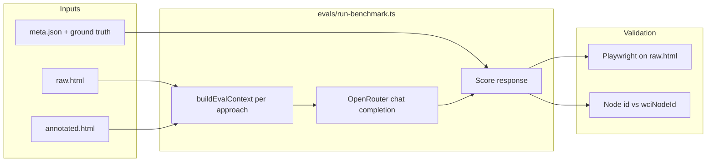

# WCI benchmark evaluation

Element-grounding benchmark: pick the correct control for a task using **OpenRouter** models (not proprietary agent SDKs).

**WebArena + WCI:** live benchmark integration, Docker bootstrap, and run commands — [`webarena/RUN.md`](./webarena/RUN.md) (overview: [`webarena/README.md`](./webarena/README.md)).

**Published runs:** [`demo/public/`](../demo/public/README.md) — per-model `eval-results-*.json` and `eval-report-*.json` with comparison tables below.

## Approaches (5 per scenario)

Each run is **single-shot element grounding**: given a natural-language **goal**, the model must name the one control that completes the task. There is no multi-step agent loop in this harness — we score whether the first pick would hit the right element. Playwright then checks that answer against verified ground truth in `demo/scenarios/` (see `evals/lib/ground-truth.ts`).

| ID | What the model sees | What it must return | How we score |
|----|---------------------|---------------------|--------------|
| **`raw-html`** | Full `raw.html` (truncated at ~28k chars if huge) — unannotated page, ads, decoys, generic button labels | One **CSS selector** | Selector must match the same element as ground-truth selectors in headless Chromium |
| **`dom-outline`** | Shallow tree (~100 lines) from raw HTML; interactive nodes marked `[interactive]` | One **CSS selector** | Same Playwright validation as raw-html |
| **`interactive-candidates`** | Numbered list of up to 50 controls scraped from raw HTML (Mind2Web-style) | Candidate **index** `[n]` or a CSS selector | Index resolved to a DOM node, then validated like raw-html |
| **`wci-full`** | JSON from `annotated.html`: **all** WCI nodes (landmarks, forms, displays, actions), parent `scope_context` merged onto children (e.g. flight `stops` on fare buttons). **No** eval state patches — page state is whatever the annotated file contains | One WCI node **`id`** string | Exact match to `wciNodeId` (or acceptable alternates); decoy ids tracked separately |
| **`wci-grounding`** | JSON from `annotated.html`: **actionable nodes only** (click/select/fill), disabled nodes omitted, same scope merge, plus **eval snapshot patches** on a few multi-step legacy scenarios (e.g. banking amount filled, checkout express selected) so the scored step is the final action | One WCI node **`id`** string | Same node-id scoring as `wci-full` |

### How to read the comparison

**Standard baselines** (`raw-html`, `dom-outline`, `interactive-candidates`) simulate agents that **do not** use WCI: they search messy DOM or lists with no `data-agent-*` layer. They share the same goals and the same underlying `raw.html` per scenario.

**WCI paths** assume an **annotation pass** already ran (`annotated.html` = same DOM as `raw.html` + `data-agent-*` overlays). The distiller/eval builder turns that into JSON; the model never sees raw tag soup for WCI conditions.

- **`wci-grounding`** is the **headline WCI score** — what you ship to an agent: small actionable menu, typed `state` / `precondition`, decision-point state where needed. Leaderboard column **“WCI Grounding”** uses this.
- **`wci-full`** is an **ablation** on the same annotations: full graph, no actionable filter, no snapshot patches. Models can answer with landmark ids (`quick-transfer`) or mid-flow controls; expect **lower** accuracy than grounding, especially on legacy banking/checkout/flight. Reported as **`wciFull`** in `eval-results.json`.

**`standard`** in the leaderboard is the average success rate across the three non-WCI approaches (not a separate API call).

Legacy CLI alias: `--approaches=wci-distilled` → `wci-grounding`.

Implementation: `evals/lib/contexts.ts` (`buildEvalContext`), prompts and truncation per row above.

## Models (default roster)

Configured in `evals/lib/llm.ts`:

| ID | OpenRouter slug |
|----|-----------------|
| `gpt5Nano` | `openai/gpt-5-nano` |
| `gpt5Mini` | `openai/gpt-5-mini` |
| `gpt5` | `openai/gpt-5` |
| `gemini3Flash` | `google/gemini-3-flash-preview` |
| `gemini35Flash` | `google/gemini-3.5-flash` |
| `gemini2FlashLite` | `google/gemini-2.0-flash-lite-001` |
| `qwen35Flash` | `qwen/qwen3.5-flash-02-23` |
| `qwen25_7b` | `qwen/qwen-2.5-7b-instruct` |
| `llama31_8b` | `meta-llama/llama-3.1-8b-instruct` |
| `deepseekV3` | `deepseek/deepseek-chat-v3-0324` |

## Commands

```bash
npm install
npx playwright install chromium

# bootstrap WebArena-facing benchmark scaffolding and WCI site drafts
npm run benchmark:wci:init
npm run benchmark:status
npm run eval:webarena:compare
npm run eval:webarena:compare -- --site=shopping
npm run eval:webarena:compare -- --runtime=hook --site=shopping
export SHOPPING=http://127.0.0.1:7770
npm run eval:webarena:annotate -- --site=shopping --verify

# Live WebArena: baseline vs WCI × OpenRouter models (requires SHOPPING + OPENROUTER_API_KEY)
npm run eval:webarena:benchmark -- --site=shopping
npm run eval:webarena:benchmark -- --models=gpt5Nano,gemini35Flash --approaches=raw-html,wci-grounding

npm run eval:verify
npm run eval:heuristic          # no API key

export OPENROUTER_API_KEY=sk-or-...
npm run eval:benchmark

# Subset of models
npm run eval:benchmark -- --models=gpt5Nano,gpt5Mini,gemini3Flash

# WCI ablation only (10 calls per model)
npm run eval:benchmark -- --approaches=wci-full,wci-grounding --models=gpt5Nano

# Subset of scenarios (50 available — see demo/scenarios/README.md)
npm run eval:benchmark -- --scenarios=flight-booking,banking,checkout
npm run eval:heuristic -- --scenarios=job-board,healthcare-portal
```

WebArena-specific bootstrap and phased WCI integration plan: [`webarena/docs/benchmark-suite.md`](./webarena/docs/benchmark-suite.md).

Minimal WebArena adapter compare runner:

- default mock dry-run: `npm run eval:webarena:compare`
- sample subset: `npm run eval:webarena:compare -- --tasks=shopping.search-wireless-headphones`
- integration-stub mode: `npm run eval:webarena:compare -- --runtime=hook`

Full run ≈ **10 models × 50 scenarios × 5 approaches = 2,500** API calls. Use `--models=`, `--approaches=`, and `--scenarios=` to limit spend. Five **legacy** scenarios have the largest hand-authored DOM; the other **45** use distinct layouts with noise/decoys and constraint-based goals (see `demo/scenarios/README.md`).

**Reasoning:** every request sends `reasoning: { effort: "low" }` with `max_tokens: 1000`.

## How the benchmark runs (end-to-end)



1. **Load scenarios** — `demo/scenarios/manifest.json` (50 ids); optional `--scenarios=` filter.
2. **Verify ground truth** (always) — Playwright resolves `rawSelectors` in each `raw.html` (`npm run eval:verify`).
3. **For each model × approach × scenario:**
   - Build prompt from `evals/lib/contexts.ts` (goal + raw HTML, outline, candidate list, or WCI JSON).
   - Call OpenRouter (`evals/lib/llm.ts`, temperature 0, reasoning low, max_tokens 1000).
   - Parse one-line answer (CSS selector, `[index]`, or WCI `id`).
   - Score: Playwright match for baselines; exact node id (+ decoy flag) for WCI.
4. **Aggregate** — per-approach success %, avg token estimate; leaderboard bundles `standard` = mean of three baselines.
5. **Write** — `demo/public/eval-report.json` (full) and `eval-results.json` (summary). Copy to `eval-report-<model>.json` to archive (see [demo/public/README.md](../demo/public/README.md)).
6. **Logs** (optional) — `evals/logs/<run-id>/<modelId>/<scenario>__<approach>.json` with prompts and responses.

**Not measured here:** multi-step agent trajectories, tool use, or live browsing — only **single-shot** “which element satisfies this goal?”

---

## Published results (50 scenarios, May 2026)

Six archived OpenRouter runs on the full scenario set (after difficulty hardening + structural diversity). Sources: `demo/public/eval-report-*.json` and [demo/public/README.md](../demo/public/README.md). Latest demo default: **GPT-5** in `eval-results.json`.

### Leaderboard summary

| Model | Standard¹ | WCI grounding | WCI full | Δ grounding − standard | Avg tokens standard² | Avg tokens WCI grounding |
|-------|-----------|---------------|----------|------------------------|----------------------|---------------------------|
| **GPT-5** | 51% | **100%** | 96% | +49 pp | 2,081 | **505** |
| **GPT-5 Nano** | 25% | **100%** | 98% | +75 pp | 2,049 | **528** |
| **GPT-OSS 20B** | 22% | **100%** | 98% | +78 pp | 1,908 | **535** |
| **Gemini 3.5 Flash** | 41% | **98%** | 96% | +57 pp | 2,234 | **541** |
| **Qwen 2.5 7B** | 31% | **90%** | 92% | +59 pp | 1,823 | **454** |
| **Llama 3.1 8B** | 13% | **92%** | 92% | +79 pp | 1,767 | **450** |

¹ **Standard** = average success of `raw-html`, `dom-outline`, and `interactive-candidates` (one number per model).  
² Token figures from `eval-results-*.json` (harness estimate / usage), not billing-grade.

### Per-approach success rate (%)

| Model | raw-html | dom-outline | interactive-candidates | wci-full | **wci-grounding** |
|-------|----------|-------------|------------------------|----------|-------------------|
| GPT-5 | 90 | 54 | 8 | 96 | **100** |
| GPT-5 Nano | 58 | 12 | 4 | 98 | **100** |
| Gemini 3.5 Flash | 88 | 28 | 8 | 96 | **98** |
| Qwen 2.5 7B | 70 | 14 | 8 | 92 | **90** |
| GPT-OSS 20B | 62 | 4 | 0 | 98 | **100** |
| Llama 3.1 8B | 20 | 16 | 4 | 92 | **92** |

### Per-approach average tokens (per scenario call)

Harness estimate: `ceil(prompt_chars / 4)` from `buildEvalContext`, or OpenRouter `usage.total_tokens` when returned (`eval-report-*.json` → `approaches[].avgTokens`). Same 50 scenarios per column.

| Model | raw-html | dom-outline | interactive-candidates | wci-full | **wci-grounding** |
|-------|----------|-------------|------------------------|----------|-------------------|
| GPT-5 | 2,993 | 2,019 | 1,230 | 632 | **505** |
| GPT-5 Nano | 3,047 | 1,914 | 1,185 | 655 | **528** |
| Gemini 3.5 Flash | 3,315 | 2,116 | 1,271 | 680 | **541** |
| Qwen 2.5 7B | 2,857 | 1,541 | 1,070 | 569 | **454** |
| GPT-OSS 20B | 2,869 | 1,738 | 1,116 | 649 | **535** |
| Llama 3.1 8B | 2,762 | 1,518 | 1,021 | 561 | **450** |

**Standard² token column** in the leaderboard table = mean of the three baseline columns above (e.g. GPT-5 Nano: (3047+1914+1185)/3 ≈ **2,049**).

### Success vs tokens (WCI grounding vs raw-html)

| Model | raw-html success | raw-html tokens | wci-grounding success | wci-grounding tokens | Token reduction³ |
|-------|------------------|-----------------|------------------------|----------------------|------------------|
| GPT-5 | 90% | 2,993 | **100%** | **505** | ~5.9× fewer |
| GPT-5 Nano | 58% | 3,047 | **100%** | **528** | ~5.8× fewer |
| Gemini 3.5 Flash | 88% | 3,315 | **98%** | **541** | ~6.1× fewer |
| Qwen 2.5 7B | 70% | 2,857 | **90%** | **454** | ~6.3× fewer |
| GPT-OSS 20B | 62% | 2,869 | **100%** | **535** | ~5.4× fewer |
| Llama 3.1 8B | 20% | 2,762 | **92%** | **450** | ~6.1× fewer |

³ Ratio = raw-html tokens ÷ wci-grounding tokens for the same model (same goals, same pages).

### Analysis

**WCI grounding wins consistently.** Every model is ≥90% on `wci-grounding` vs ≤51% on the standard bundle (best: **GPT-5** at 51% standard / **100%** grounding). The distillation path (actionable nodes + `state` / `scope_context` + semantic ids) removes most DOM search error — **GPT-5 Nano** still reaches **100%** grounding at only **25%** standard.

**Baselines are not equal.** `raw-html` varies from 20% (Llama) to **90%** (GPT-5) on the same 50 pages. **GPT-5** is the only model above 50% on **`dom-outline`** (54%); everyone else is 4–28%. **`interactive-candidates`** stays weak (0–8%) because the list caps at 50 controls with little semantics.

**Qwen 2.5 7B** sits between small and frontier models: **70%** raw-html, **90%** WCI grounding (5 missed scenarios), ~**454** tokens on grounding — strong efficiency, slightly below GPT-5/Gemini on accuracy.

**Legacy vs generated (GPT-5 Nano, raw-html):** On the five rich legacy pages (`flight-booking` … `admin-dashboard`), raw-html succeeds **1/5**; on the 45 generated layouts **28/45**. Legacy DOM is larger and more adversarial; generated pages are noisy but often expose a unique `data-*` anchor the model can find.

**WCI full vs grounding:** The ablation loses 0–2 scenarios per model (e.g. Gemini grounding 98% vs full 96%). Failures are usually **landmark or mid-flow ids** on full graph without snapshot patches — expected from `wci-full` design.

**Llama on legacy WCI:** Llama misses **banking, checkout, social-feed, admin-dashboard** on both WCI paths (46/50) — flight-booking passes. Those pages need tighter reasoning over preconditions; smaller models benefit most from `wci-grounding` filter but still slip on the hardest legacy tasks.

**Tokens:** WCI grounding uses ~**450–540** tokens per call vs **2,762–3,315** for raw-html (see per-approach table). `dom-outline` is smaller than raw-html but still **3–4×** larger than WCI grounding with far lower accuracy. `interactive-candidates` is the smallest baseline (~1,000–1,300 tokens) but the weakest scorer (0–8%).

---

## Limitations of this evaluation

These numbers are useful for comparing **context formats on a fixed grounding task**, but they are **not** a complete measure of “agent success on the real web.” Treat the following as scope boundaries, not minor footnotes.

### What the harness does *not* measure

| Gap | Why it matters |
|-----|----------------|
| **Multi-step trajectories** | One goal → one answer per call. No observe → act → observe loop, backtracking, or error recovery after a wrong click. |
| **Live browsing** | Static `raw.html` / `annotated.html` files in `demo/scenarios/`, loaded in Playwright — not dynamic SPAs, network delays, auth, or post-click DOM updates. |
| **Annotation cost / quality** | WCI paths assume `data-agent-*` is already correct and complete. The benchmark does not score mis-annotation, drift, or pages without annotations. |
| **Tooling ecosystems** | Models answer via OpenRouter chat only — not Browser Use, Playwright agents, computer-use APIs, or site-specific SDKs. |
| **End-user outcomes** | Success = “picked the element Playwright agrees is correct,” not task completion (payment succeeded, form submitted, etc.). |

### Task and dataset design

- **Synthetic scenarios** — Fifty fictional UIs (five large legacy pages + forty-five generated layouts). They are adversarial by design (noise, decoys, constraint-based goals) but still **offline fixtures**, not production traffic or public benchmarks like WebArena/Mind2Web pages at scale.
- **Single ground-truth step** — `meta.json` / `ground-truth.ts` define one target control per scenario. Real tasks often require several actions; `eval-snapshot.ts` only patches state for a few legacy flows so the *scored* step is the final button, which **helps** WCI grounding but is not how an agent always arrives there.
- **Heterogeneous difficulty** — Legacy scenarios (e.g. `flight-booking`, `banking`) differ sharply from generated ones; a single aggregate % blends unlike DOM sizes and failure modes.
- **Iterative benchmark tuning** — Goals, noise, and selectors were hardened so raw baselines stay hard while WCI stays solvable. Reported gaps partly reflect **this suite’s design**, not a universal law for all websites.

### Fairness of “standard” vs WCI

- **Asymmetric information** — Baselines see raw or derived DOM; WCI sees curated JSON with `desc`, `state`, `scope_context`, and (for grounding) an actionable-only filter. Higher WCI accuracy is expected; the fair claim is **efficiency + reliability given annotations exist**, not “same bits in, same bits out.”
- **`standard` is a blended metric** — Averaging `raw-html`, `dom-outline`, and `interactive-candidates` hides that some models score well on raw HTML (e.g. Gemini 88%) while outline/candidates stay near zero. Compare **per-approach tables**, not only the headline `standard` column.
- **`wci-full` ablation** — Still uses annotations without production filtering; it is not an unannotated baseline.

### Scoring and validation

- **Playwright-only check for baselines** — CSS selectors must parse and match ground-truth locators in Chromium. Model outputs using unsupported pseudo-selectors (e.g. `:has-text()` from legacy admin/banking) count as failures even when a human would understand the intent (`validationError` in `eval-report-*.json`).
- **Exact node id for WCI** — No partial credit for semantically close ids unless listed in `acceptableNodeIds`. Typos and alias resolution depend on `evals/lib/scorers.ts` heuristics.
- **No human eval** — Labels are author-defined; there is no inter-annotator agreement or crowd verification on the 50 goals.

### Model and runtime

- **Single provider stack** — OpenRouter, temperature `0`, `reasoning: { effort: "low" }`, `max_tokens: 1000` (see `evals/lib/llm.ts`). Other settings or hosts can change rankings.
- **Token figures are approximate** — Per-call `avgTokens` mixes harness `ceil(chars/4)` estimates and API usage when returned; they guide **relative** cost between approaches, not invoice accuracy.
- **Model roster changes** — Published snapshots in `demo/public/` are point-in-time; new models or API versions are not automatically comparable to archived JSON.

### How to use these results responsibly

- Use **`wci-grounding` vs baselines** to argue that structured context helps **one-shot control selection** on annotated pages.
- Do **not** claim the benchmark proves full autonomous agents beat commercial browser automation products without matching their task definitions and observation spaces.
- Prefer **subset runs** (`--scenarios=`, `--approaches=`) when adding scenarios or models, and archive reports under `demo/public/eval-report-<model>.json` for reproducibility.

---

## Outputs

| Artifact | Role |
|----------|------|
| `demo/public/eval-results.json` | Leaderboard: `standard`, `wci`, `wciFull` |
| `demo/public/eval-report.json` | Full `byScenario` audit trail |
| `demo/public/eval-results-<model>.json` | Archived run (see [demo/public/README.md](../demo/public/README.md)) |
| `demo/public/eval-report-<model>.json` | Archived full report |
| `evals/logs/<run-id>/` | Per-call LLM I/O (JSON + Markdown). Disable with `--no-logs`. |

### LLM I/O logs

```
evals/logs/2026-05-22_21-20-48/
  manifest.json
  gpt5Nano/
    flight-booking__wci-grounding.json
    job-board__raw-html.md
    ...
```

The demo leaderboard loads **`demo/public/eval-results-all.json`** (merge archived runs with `npm run eval:merge-leaderboard`). It shows all models: standard baselines, WCI grounding, WCI full, and token averages per call.
